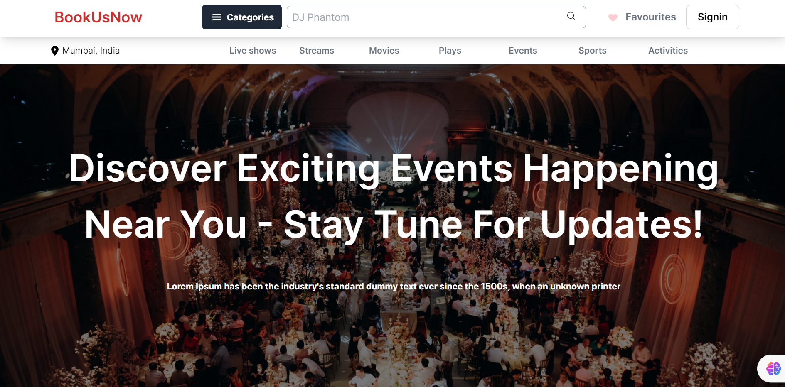

## Project Overview
This is a Frontend Task @GyanGrove. This is a Event website that shows upcoming and recommended events. This is mobile responsive. And the events are fetched from the given API.

## A Glimpse at the Project 

# Desktop-view

# Mobile View

## Technical Features
1. Redux for state management (for highly optimized data management)
2. Lazy Loading of components
3. Responsive design
4. Modular code
5. API data fetching
6. Infinite scroll for Upcoming events
7. Display of Loading state while data being fetched

## Local setup
1) Clone the repository:
    Clone the project repository to your local machine using Git. For example:
    `git clone <repository-url>`
2) Navigate to the project directory:
    Change your working directory to the root of the cloned project:
    `cd <project-directory>`
3) Install dependencies:
    Install project dependencies using npm (Node Package Manager). Run
    `npm install`
4) Build the project:
   Build the project using Webpack to generate the necessary bundled files. Run
   `npm start`
5) Access the application:
    Once the development server is running, open your web browser and navigate to `http://localhost:8080` (or a different port if specified) to access the React application.

## Design and Technical Decisions
1. The UI is designed in a way that it can be viewed on both desktop and mobile devices, ensuring maximum user accessibility. This responsiveness
2. The overall design of this app is a single page application with ReactJS as the main library, along with Redux for managing global states
3. Lazy Loading is used to optimize the rendering and for reducing size of JS bundles (only render when required)
4. Loading states are used to keep the user engaged instead of showing blanks
5. The UI has been designed keeping in mind accessibility standards, color contrasts etc.
6. Recommended events are scrollable
7. Upcoming events are Infinite scrollable
8. For optimization in state management, Redux is used primarily

